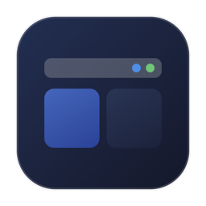

<p align="center">
  
</p>

<h1 align="center">MenuBarApps (菜单栏应用与磁盘管家)</h1>

<p align="center">
  <strong>一款专为解决 macOS 屏幕右上角图标拥挤、内存膨胀与无用缓存堆积打造的原生超轻量管家。</strong><br>
  <em>A lightweight native macOS menu bar, running app & disk cache cleaner.</em>
</p>

<p align="center">
  
  
  
  
</p>

<p align="center">
  <a href="#-中文文档">中文文档</a> •
  <a href="#-english-documentation">English Documentation</a>
</p>

---

## 🇨🇳 中文文档

### 💡 为什么需要 MenuBarApps？

在 macOS 上，随着安装的菜单栏辅助工具增多（尤其在**刘海屏 MacBook** 上），屏幕右上角状态栏极易被撑满，导致后面的应用被遮挡或挤出屏幕，用户**既不知道哪些程序在后台常驻运行，也无法右键退出它们**。

此外，长期使用的 Mac 往往在后台堆积了大量无用缓存（Chrome 媒体缓存几 G、Homebrew 安装包几百兆、项目编译构建件几十 G），而传统磁盘工具只按大小排序，用户不敢轻易下手。

**MenuBarApps** 将 **「后台应用管理」** 与 **「智能白名单磁盘清理」** 合二为一，用极简的单图标与快捷键，同时搞定**物理内存监控、进程调度与磁盘瘦身**。

---

### ✨ 核心功能特性

#### 1. 📱 应用与常驻服务管理 (App & Service Management)
* ⚡ **极简常驻，数字角标**：在菜单栏仅占用单图标位，实时小字显示当前运行的后台辅助应用总数（如 ` 5`）。
* ⌨️ **全局快捷键一键唤出**：默认支持 `Option + Shift + A` (`⌥⇧A`)，即便菜单栏图标被挤出视野，也可随时居中呼出浮窗。
* 🔍 **智能分类与快速搜索**：清晰划分 **「菜单栏」**、**「窗口应用」** 与 **「终端/AI」**，内置即时搜索框。
* 🤖 **终端 / AI 常驻服务监控 (CLI & AI Agents)**：无需 `.app` 外壳，自动通过内核接口捕获终端运行的本地模型与智能体（**Ollama、Claude Code、Kimi Code、Pi Agent、Aider、Open Interpreter** 等），实时呈现真实物理内存，并支持一键终止或重启！
* 📊 **实时物理内存 (RSS) 监控**：基于底层 `libproc` 接口，零开销显示每个进程真实内存，辅以三色预警（常规 / 橙色>200MB / 红色>500MB）。
* 🔄 **一键重启（瞬间释放内存）**：一键关闭并在后台静默拉起应用或后台服务，瞬间清空如 Maccy 或本地模型服务的内存碎片。
* 🚀 **动态点击状态响应**：打开显示 `已唤起 ✓`，重启显示转圈菊花，退出立即置灰淡出。

#### 2. 🧹 磁盘缓存扫雷与清理 (Disk Cleaner)
* 🎯 **纯白名单安全扫描**：只扫描 100% 安全可删的无害缓存，彻底杜绝误删系统文件：
  * **🌐 浏览器多媒体缓存**：Chrome / Safari / Edge 离线图片与视频流缓存（常占 2GB~5GB）；
  * **🍺 包管理器安装包残留**：Homebrew 下载的 `.tar.gz` 离线包、Python pip 缓存、npm 缓存；
  * **🔨 开发者编译构建中间件**：Xcode `DerivedData`、Swift 项目 `.build`、Python `__pycache__`；
* 🛡️ **双锁安全网关与优雅清理**：通过 `CleanerSafetyValidator` 双重检验，保护根目录与目录属性，只清理内部缓存文件；
* 🔍 **透明下钻与访达联动 (Detail Drill-down & Finder)**：点击任意项目右侧 `›` 即可无缝进入明细面板，查看绝对物理路径、100% 安全原理解释以及体积最大的具体子文件/子目录；支持一键在访达中定位并打开，亦可在此单独清理该项。

---

### 📥 下载与安装

1. 从 [Releases 页面](../../releases) 下载最新的 `MenuBarApps-v1.3.zip`；
2. 解压后将 `MenuBarApps.app` 拖移至系统 **“访达 -> 应用程序 (Applications)”**；
3. **首次打开**：按住 `Control` 键点击应用图标，选择 **“打开”**，然后点击 **“仍要打开”** 即可。

---

### 🛠️ 源码构建

```bash
# 1. 克隆仓库
git clone https://github.com/quiet52/MenuBarApps.git
cd MenuBarApps

# 2. 一键编译并打包
./build.sh
```

---

## 🇺🇸 English Documentation

### 💡 Why MenuBarApps?

On macOS (especially on MacBooks with camera notches), the menu bar easily runs out of space, hiding background apps off-screen. Meanwhile, developers run memory-hungry local AI agents and daemons without visibility, and suffer from silent disk hogs (multi-gigabyte browser caches, stale package installers, Xcode DerivedData, `.build` folders).

**MenuBarApps** integrates **Active App & CLI Agent Management** with a **Safe Whitelist Disk Cleaner** in a single, lightweight menu bar popover.

---

### ✨ Key Features

#### 1. 📱 App & Service Management
* ⚡ **Live Status Item**: Minimalist icon displaying the count of background accessory apps.
* ⌨️ **Global Shortcut**: `Option + Shift + A` (`⌥⇧A`) opens the dashboard anywhere.
* 🔍 **Smart Grouping**: Separates menu bar accessory apps, standard GUI window apps, and **Terminal/AI Services**.
* 🤖 **Terminal & AI Agent Services**: Native detection for headless CLI models and TUI assistants (**Ollama, Claude Code, Kimi Code, Pi Agent, Aider**, etc.) with live memory reporting and one-click termination/restart.
* 📊 **Live RSS Memory Footprint**: Kernel-level memory reporting with color-coded badges.
* 🔄 **One-Click Restart**: Terminates and silently relaunches memory-bloated apps (like Maccy or Ollama) to flush RAM instantly.
* 🚀 **Clear Action Feedback**: Visual indicators for opening, restarting spinner, and dimming on quit.

#### 2. 🧹 Safe Disk Cleaner
* 🎯 **Strict Whitelist Scanning**: Only detects 100% safe-to-delete caches:
  * Browser media/image caches (Google Chrome, Safari, Edge, Firefox)
  * Package managers offline archives (Homebrew `.tar.gz`, pip, npm, Yarn, CocoaPods)
  * Developer build directories (Xcode `DerivedData`, Swift `.build`, `__pycache__`)
* 🛡️ **Double-Lock Safety Gate**: Protected by `CleanerSafetyValidator`, preserving root directories and deleting only disposable contents.
* 🔍 **Transparent Drill-down & Finder Integration**: Click `›` on any item to view its absolute path, safety rationale, and top largest files/subfolders; open directly in Finder or clean individually.

---

### 📥 Download & Installation

1. Download `MenuBarApps-v1.3.zip` from [Releases](../../releases);
2. Unzip and drag `MenuBarApps.app` to your `/Applications` folder;
3. **First launch**: Right-click (or Control-click) `MenuBarApps.app`, select **Open**, and click **Open Anyway**.

---

### 🛠️ Build from Source

```bash
# Clone the repository
git clone https://github.com/quiet52/MenuBarApps.git
cd MenuBarApps

# Build and package
./build.sh
```

---

## 📄 License

This project is licensed under the [MIT License](LICENSE).

